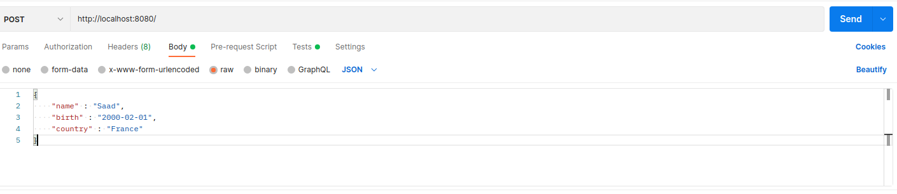
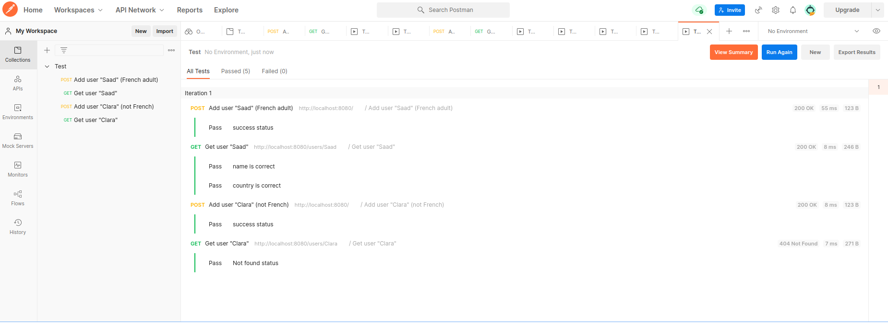

# Test Offer

## Documentation :  

### 🚀 Build : 

```bash
mvn clean  
mvn compile  
mvn package  
java -jar target/demo-0.0.1-SNAPSHOT.jar
```  
or

```bash 
./mvnw springboot:run
```

### 📚 Use of the API :   
The API exposes two services :  
- Registration of the user by a post mapping (the user's information must contain the name - date of birth (yyyy-mm-dd) - country + some optional information : gender - phone number).  
- Display of user information by making a get mapping using the url ```/users/{id}```, the id represents the name of the user. 

### 🌟 How to use : 

- Launch the server using the build commands. 
- Add a user using a post request. Two possibilities of test, using ```curl``` or ```postman```. Below are examples of post requests.
  - 🧐 Using curl : 

  ```bash
  curl --header "Content-Type: application/json" --request POST --data '{"name":"zoubairi", "birth": "2001-02-10", "country":"France", "gender":"Male"}' "http://localhost:8080/"
  ```
  - 👨‍💻 Using Postman

  
  
- Search the information of a user using the name field. (Using a postman get request or directly using the url ``` http://localhost:8080/users/{id}```

### ✔️ Tests (Postman collection):
  
  
### Lien Swagger : 
  ```https://localhost:8080/swagger-ui.html```

